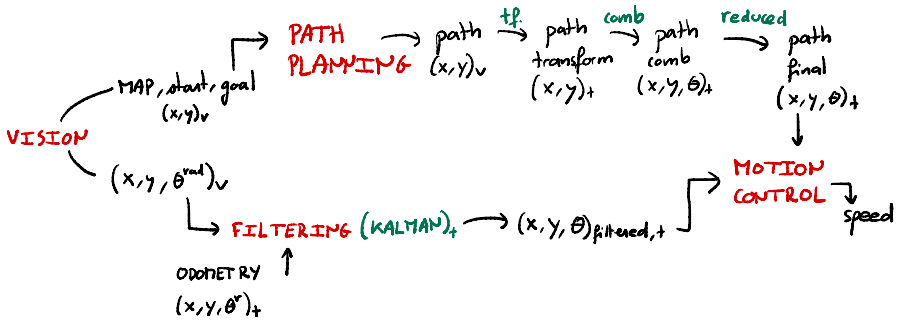

# Autonomous Navigation of a Thymio Robot

**EPFL - Basics of Mobile Robotics (2024-2025) - Group 36**

> Autonomous navigation system for a Thymio robot using computer vision, global path planning, and real-time state estimation.

## Demo

<!-- TODO: Replace with your actual video -->
<!-- Option 1: YouTube embed -->
<!-- [](https://www.youtube.com/watch?v=YOUR_VIDEO_ID) -->

<!-- Option 2: Local video file (GitHub won't play MP4 in markdown, use a GIF or a link) -->
<!--  -->

> **Video coming soon** 
 — A demonstration of the Thymio navigating the map autonomously.

## Overview

This project implements a complete autonomous navigation pipeline for a [Thymio](https://www.thymio.org/) educational robot. The robot navigates from a start position to a goal position on a physical map while avoiding obstacles, using an overhead camera for localization.

The system combines five core modules:

| Module | Role |
|--------|------|
| **Vision** | Camera-based detection of the robot, goal, and obstacles via color filtering and perspective transform |
| **Path Planning** | A* search on a discretized grid to compute a global path |
| **Motion Control** | Proportional controller to follow waypoints |
| **Filtering** | Extended Kalman Filter (EKF) fusing vision and odometry |
| **Safety** | Local obstacle avoidance (Braitenberg-style) and kidnapping detection |

## Architecture



## Main Implementation

### 1. Vision System

The overhead camera captures the physical map. The pipeline:

1. **Perspective Transform** — Detects four black cross markers at the map corners using template matching (`cv2.matchTemplate`), then warps the image to a bird's-eye view.
2. **Obstacle Detection** — Applies an HSV bandpass filter for blue objects, followed by morphological operations. Obstacles are dilated by the Thymio's footprint (~29 px) to allow point-representation of the robot.
3. **Goal Detection** — Filters for green color in HSV, finds the largest contour, and computes its centroid.
4. **Robot Pose Detection** — Detects two red circles on the Thymio (different sizes). The position is the midpoint of both circles; the heading is derived from `arctan2` between them.
5. **Camera Obstruction Check** — If the frame is mostly dark (< 200 non-zero pixels), vision updates are skipped.

### 2. Path Planning (A*)

- **Algorithm**: A* search on an 8-connected grid (orthogonal + diagonal movement).
- **Heuristic**: Manhattan distance.
- **Post-processing**: The raw path is simplified by merging consecutive waypoints with the same heading, then transformed from the vision coordinate frame to the robot frame and scaled from pixels to millimeters.

### 3. Motion Control

A proportional (P) controller steers the robot toward each waypoint:

- Computes the angle error between the current heading and the direction to the next waypoint.
- Adjusts left/right motor speeds proportionally to the error.
- Two regimes: higher gain + speed when far from the goal, lower when close.
- A waypoint is considered reached when the robot is within **40 mm**.

### 4. Extended Kalman Filter (EKF)

State vector: `[x, y, θ, v_right, v_left]`

- **Prediction step**: Uses a differential-drive odometry model with Jacobian linearization.
- **Update step (vision available)**: Full 5D measurement update using camera observations.
- **Update step (camera obstructed)**: Falls back to motor encoder readings only, relying on odometry for position propagation.

Key parameters:
- Wheel baseline: 100 mm
- Motor-to-speed ratio: 0.12 mm/s per motor unit
- Update rate: 0.5 s

### 5. Safety Layer

- **Local Obstacle Avoidance**: A weighted neural network (Braitenberg vehicle) reads the Thymio's 5 front proximity sensors and computes corrective motor commands to steer around unexpected obstacles.
- **Kidnapping Detection**: Monitors accelerometer data. If a sudden high acceleration is detected alongside a ground sensor change, the robot stops immediately.

## Dependencies

- **Python 3.x**
- [tdmclient](https://pypi.org/project/tdmclient/) — Thymio Device Manager client
- [OpenCV](https://opencv.org/) (`cv2`) — Computer vision
- [NumPy](https://numpy.org/) — Numerical computation
- [SciPy](https://scipy.org/) — Distance calculations
- [Matplotlib](https://matplotlib.org/) — Visualization

## How to Run

1. Connect the Thymio robot via USB or wireless dongle.
2. Set up the overhead camera pointing at the map (resolution: 1024x768).
3. Place the map with four black cross markers at the corners, blue obstacles, a green goal, and the Thymio with two red markers.
4. Install dependencies:
   ```bash
   pip install tdmclient opencv-python numpy scipy matplotlib
   ```
5. Open and run `Mobile_Robotics_Project_groupe_36_modified.ipynb` in Jupyter.

## Limitations and Problems Encountered

### Sensor Imprecision
The Thymio's built-in sensors proved significantly imprecise, causing difficulties with both motion control and state estimation. Motor speed readings and proximity sensor values were noisy, requiring careful EKF tuning.

### Camera and Lighting Sensitivity
The vision pipeline relies on HSV color filtering with fixed thresholds. Changes in ambient lighting, shadows, or reflections could cause failures in corner detection, obstacle segmentation, or robot pose estimation. The template matching threshold (0.84) needed manual calibration per environment.

### Odometry Drift
When the camera is obstructed, the EKF relies solely on odometry, which accumulates position error rapidly. Prolonged occlusion leads to significant state divergence that is hard to recover from.

### P-Controller Limitations
The proportional controller gains were empirically tuned for specific conditions (floor surface, battery level). The robot sometimes exhibited jerky motion near waypoints due to motor speed saturation and the discrete 40 mm success threshold.

### Static Path Planning
The A* planner assumes a static environment. If a new obstacle appears after planning, the system relies entirely on the local avoidance layer — there is no global replanning mechanism.

### Coordinate Frame Complexity
Multiple reference frames (camera, bird's-eye, map grid, robot body) required several transforms scattered across the code, making debugging error-prone.

### Hardcoded Configuration
Camera index, file paths (e.g., template images), color thresholds, and robot parameters are hardcoded, reducing portability across different setups.

## Team

| Member | Contribution |
|--------|-------------|
| **Victor** | Vision processing |
| **Hoang** | Path planning and motion control |
| **Tomas** | EKF filtering, kidnapping detection, local obstacle avoidance |
